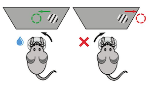
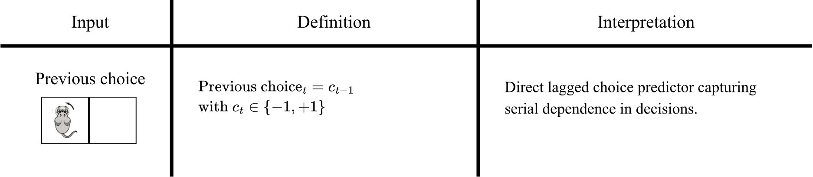
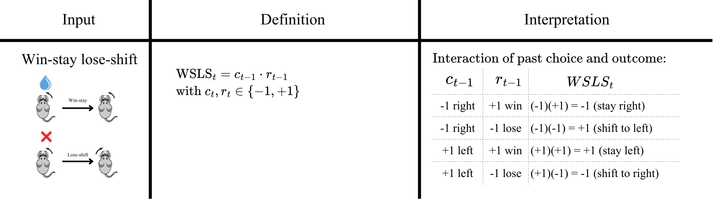
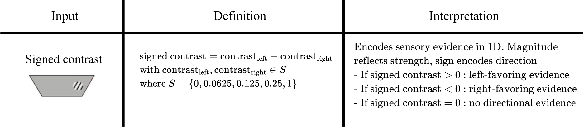

---
jupytext:
  text_representation:
    extension: .md
    format_name: myst
    format_version: 0.13
    jupytext_version: 1.19.1
kernelspec:
  display_name: glm_hmm_notebook (3.12.10)
  language: python
  name: python3
---

```{code-cell} ipython3
:tags: [render-all]

import warnings

warnings.filterwarnings(
    "ignore",
    message="coroutine .* was never awaited",
    category=RuntimeWarning,
)
```

:::{admonition} Jupyter Lab tip
:class: important render-all

Newer versions of Jupyter Lab have addressed an issue with skipping around the notebook while scrolling. To make sure this fix is enabled, in the Jupyter Lab GUI, navigate to `Settings > Settings Editor > Notebook` and scroll down to the `Windowing mode` setting and make sure it is set to `contentVisibility`. 

Also reminder to presenter: Go to `View > Appearance`, select `Simple Interface` and turn off everything else to hide as many bars as possible. And maybe activate `Presentation Mode`.

And turn on `View > Render side-by-side` (shortcut `Shift+R`).
:::

+++

# Infer behavioral strategies during decision making with GLM-HMMs
<div class="render-all">

In this notebook, we will learn how to model behavioral choices by fitting a GLM-HMM, replicating the main findings of Ashwood et al. (2022) <span id="cite1a"></span><a href="#ref1a">[1a]</a>. 


We will do this in four steps: 

1. Download and preprocess the data
2. Build a design matrix with three predictors
3. Fit the model 
4. Interpret the results

</div>


## 01. Download and preprocessing of data

:::{admonition} What do we want to do in this subsection?
:class: attention render-all

1. Download the dataset
2. See what it contains
3. Subset the sessions we are interested in

:::


### Dataset

<div class="render-all">
Data for this notebook comes from the IBL decision-making task (IBL et al., 2021) <span id="cite2c"></span><a href="#ref2c">[2c]</a>, a variation of the two-alternative forced-choice perceptual detection task (Burgess et al., 2021 <span id="cite3c"></span><a href="#ref3c">[3c]</a>).

During this task, a sinusoidal grating with varying contrast [0\%-100\%] appeared either at the right or left side of the screen. The mice indicated this side by turning a small wheel, which moved the stimulus toward the center of the screen (Burgess et al., 2021 <span id="cite3b"></span><a href="#ref3b">[3b]</a>). If the mice chose the side correctly, they would receive a water reward; if not, they would get a noise burst and a 1-second timeout. For the first 90 trials of each session, the stimulus appeared on the left or right side with 50% probability and then this probability shifts, biasing towards one side or the other, alternating randomly every 20–100 trials. 

</div>

<div class="render-presenter">
- Data from the IBL decision-making task (IBL et al., 2021) <span id="cite2c"></span><a href="#ref2c">[2c]</a>, 
- variation of the two-alternative forced-choice perceptual detection task (Burgess et al., 2021 <span id="cite3c"></span><a href="#ref3c">[3c]</a>).

- sinusoidal grating with varying contrast appeared either at the right or left side of the screen. 
- Mice had to indicate where it appeared
- If the mice chose the side correctly, they would receive a water reward; if not, they would get a noise burst and a 1-second timeout. 
- For the first 90 trials of each session, the stimulus appeared on the left or right side with 50% probability 
-  then this probability shifts, biasing towards one side or the other, and it alternated randomly every 20–100 trials. 
</div>


<div class="render-all">



*Task illustration. Modified from IBL et al. (2021)* <span id="cite2b"></span><a href="#ref2b">[2b]</a>.

</div>


### Data Streaming

<div class="render-all">
Let's download the data using  <a href="https://int-brain-lab.github.io/ONE/one_reference.html">Open Neurophysiology Environment (ONE)</a>
</div>

<div class="render-presenter">
We will download the data from this task using  <a href="https://int-brain-lab.github.io/ONE/one_reference.html">Open Neurophysiology Environment (ONE). </a>

- This is a protocol for standardizing, searching and sharing neurophysiology data. 
- On the one hand it defines conventions for how to store and share neurophysiology data and 
- on the other it provides an API to search and load datasets which can be stored on a remote server or local machine. 
- We will use this to download data from the International Brain Laboratory.

(API:  stands for application programming interface, is a set of protocols that enable different software components to communicate and transfer data)</a>
</div>

<div class="render-presenter">
1. First we run this
2. We are getting all of our imports to run the code
4. For the 64-bit floating point: By default, JAX uses 32-bit precision (float32) because it is faster and more memory-efficient, especially on GPUs and TPUs. However, when dealing with a glm-hmm we compute quantities a bunch of times and some of those quantities are very small numbers. So with float64 we just guarantee more numerical stability i.e avoid small numerical errors to propagate. 
3. And helper plotting functions

JAX is nemos backend - many operations in nemos are performed using jax. we might want to change the global setting of jax as this affects how nemos performs computations
</div>

```{code-cell} ipython3
:tags: [render-all]

# Imports
import seaborn as sns
import matplotlib.pyplot as plt
import os
import numpy as np
from one.api import ONE
import nemos as nmo
import workshop_utils
import jax

# Enable 64-bit floating-point and integer types
jax.config.update("jax_enable_x64", True)

# Plotting params
custom_params = {"axes.spines.right": False, "axes.spines.top": False}
sns.set_theme(style="ticks", palette="colorblind", font_scale=1.5, rc=custom_params)#, context="notebook")
```

<div class="render-presenter">
1. Now we are setting where we want our data to be download, if we run and print it we will get a directory.
</div>

```{code-cell} ipython3
:tags: [render-all]

# Set up where we want our data to be downloaded
data_dir = os.environ.get("NEMOS_DATA_DIR")
print("IBL data dir:", data_dir)
```

<div class="render-presenter">
1. First we setup our ONE object using the setup function. 

- This function (more precisely class method) creates or updates the local configuration used by one. - It stores information such as which server to connect and authentication details. 
- Here we are specifying we want to connect to the international brain laboratory database.
- We are also saying we want to set the silent keyword argument to True, to suppress interactive messages
- we run this
</div>

```{code-cell} ipython3
:tags: [render-all]

# Configure 
ONE.setup(
    base_url='https://openalyx.internationalbrainlab.org', 
    silent=True
)
```
<div class="render-presenter">
2. Then we initialize our ONE object. We pass it "international" as a password, which is used to authenticate the alyx server we just connected to. This allows ONE to log in and access datasets that require authentication
3. with cache_dir we are specifying where we want the data to be stored locally. When a dataset is requested, ONE first checks whether it already exists in the cache directory. If not, it downloads it and saves it here.

</div>

```{code-cell} ipython3
:tags: [render-presenter]
# Instantiate ONE object
one = ONE(password = 'international', cache_dir=data_dir)
```

<div class="render-user">

```{code-cell} ipython3
# Instantiate ONE object
one = # Complete
```
</div>

<div class="render-presenter">
- Next, we load the behavioral data for one subject from the IBL aggregate dataset.
- let's run this
- and see what we have: we are choosing this particular subject moving forward to replicate the figures in ashwood et al.
- then the `load_aggregate` function retrieves a preprocessed table containing trial-by-trial information,
- we can see that our output is a pandas dataframe
</div>

```{code-cell} ipython3
:tags: [render-all]

# Then we need to choose our subject and run load_aggregate
subject = "CSHL_008"
trials = one.load_aggregate('subjects', subject, '_ibl_subjectTrials.table')

# We can see the type of object we are dealing with
print(type(trials))
```

<div class="render-presenter">
- we can see how it looks. we scan see that it has one row per trial and one column per measured variable. 
</div>


```{code-cell} ipython3
:tags: [render-all]

# We can see how it looks like
trials.head(5)
```
<div class="render-presenter">
- And by printing the columns we see all the information we could gather
</div>


```{code-cell} ipython3
:tags: [render-all]

# We can see the information we get by printing the columns
trials.columns

```

<div class="render-presenter">
- We are modeling choice as result of observables and behavioral state, so we need choice, stimuli presented and reward obtained. 
- Additionally, we want to keep the information of the probability of the stimulus appearing in a given position since this changes within a session, and the session id to know when sessions start and end.
- So we can take a subset of the columns

</div>

<div class="render-presenter">
- DO NOT MENTION THE TABLE

</div>

<div class="render-all">

<table style="border-collapse: collapse; width: 100%; font-size: 0.95em;">
  <thead>
    <tr style="background-color: #2c3e50; color: #ffffff;">
      <th style="padding: 8px 12px; text-align: left; border: 1px solid #ccc; white-space: nowrap; width: 180px;">Variable</th>
      <th style="padding: 8px 12px; text-align: left; border: 1px solid #ccc;">Description</th>
    </tr>
  </thead>
  <tbody>
    <tr style="background-color: #f6f8fa;">
      <td style="padding: 8px 12px; border: 1px solid #ccc; font-family: monospace; font-weight: bold; color: #2c3e50; text-align: left; white-space: nowrap; width: 180px;">choice</td>
      <td style="padding: 8px 12px; border: 1px solid #ccc; text-align: left;">mouse choice: 1 = choice left, -1 = choice right, 0 = violation (no response within the trial period). Since we are going to use a Bernoulli GLM, we will remap the variables to 1 = choice left and 0 = choice right at the end of preprocessing.</td>
    </tr>
    <tr style="background-color: #ffffff;">
      <td style="padding: 8px 12px; border: 1px solid #ccc; font-family: monospace; font-weight: bold; color: #2c3e50; text-align: left; white-space: nowrap; width: 180px;">contrastLeft</td>
      <td style="padding: 8px 12px; border: 1px solid #ccc; text-align: left;">contrast of stimulus presented on the left</td>
    </tr>
    <tr style="background-color: #f6f8fa;">
      <td style="padding: 8px 12px; border: 1px solid #ccc; font-family: monospace; font-weight: bold; color: #2c3e50; text-align: left; white-space: nowrap; width: 180px;">contrastRight</td>
      <td style="padding: 8px 12px; border: 1px solid #ccc; text-align: left;">contrast of stimulus presented on the right</td>
    </tr>
    <tr style="background-color: #ffffff;">
      <td style="padding: 8px 12px; border: 1px solid #ccc; font-family: monospace; font-weight: bold; color: #2c3e50; text-align: left; white-space: nowrap; width: 180px;">feedbackType</td>
      <td style="padding: 8px 12px; border: 1px solid #ccc; text-align: left;">reward obtained: 1 = success, -1 = failure</td>
    </tr>
    <tr style="background-color: #f6f8fa;">
      <td style="padding: 8px 12px; border: 1px solid #ccc; font-family: monospace; font-weight: bold; color: #2c3e50; text-align: left; white-space: nowrap; width: 180px;">probabilityLeft</td>
      <td style="padding: 8px 12px; border: 1px solid #ccc; text-align: left;">probability of stimulus being presented on the left of the screen</td>
    </tr>
    <tr style="background-color: #ffffff;">
      <td style="padding: 8px 12px; border: 1px solid #ccc; font-family: monospace; font-weight: bold; color: #2c3e50; text-align: left; white-space: nowrap; width: 180px;">session</td>
      <td style="padding: 8px 12px; border: 1px solid #ccc; text-align: left;">id of session</td>
    </tr>
  </tbody>
</table>

Let's extract what we need, and inspect its contents.

</div>

<div class="render-presenter">
So here, we just subset choice, contrast at each side, reward information, probability of stimulus appearing on the left and session, and afterwards we simply have print statements with the sorted values that we get and the types of values that we get.

- here -1 corresponds to a choice to the right, 0 to an invalid trial and 1 to a leftward choice. this is an integer
- contrast left and and right correspond to the contrast of the stimulus presented. we have some nan values here because nan indicates that no stimulus was presented on that side. in reality it means the same as having 0 contrast
- a reward of -1 indicates the mouse made the wrong call, whilst a reward of 1 means they made the right call.
- probability of stimulus on left can take many values between 0 and 1. we will later subset only the ones corresponding to .5
- session values are strings of numbers
</div>

```{code-cell} ipython3
:tags: [render-all]

trials = trials[
    [
        "choice", "contrastLeft", "contrastRight", 
        "feedbackType", "probabilityLeft", "session"
    ]
]

print(f"choice \nvalues: {np.sort(trials.choice.unique())}, data type: {trials.choice.dtype} \n")
print(f"contrast left \nvalues: {np.sort(trials.contrastLeft.unique())}, data type: {trials.contrastLeft.dtype} \n")

print(f"contrast right \nvalues: {np.sort(trials.contrastRight.unique())}, data type: {trials.contrastRight.dtype} \n")

print(f"reward \nvalues: {np.sort(trials.feedbackType.unique())}, data type: {trials.feedbackType.dtype} \n")

print(f"probability of stimulus on left \nvalues: {np.sort(trials.probabilityLeft.unique())}, data type: {trials.probabilityLeft.dtype} \n")

print(f"session \n(some) values: {trials.session.unique()[:5]}, data type: {trials.session.dtype}\n")
```

</div>


:::{admonition} Working without pynapple
:class: note render-all

Unlike the other notebooks in this workshop, here we work directly with `pandas` DataFrames and `numpy` arrays rather than pynapple objects. The IBL trial data is trial based, with no continuous time axis. Pynapple would not represent this well, so we keep it as a DataFrame and show how NeMoS interfaces with plain NumPy. NeMoS also accepts pynapple `Tsd`/`TsdFrame` objects directly, and we point out as we go where that would change the workflow (for example, how session boundaries are handled).
:::

<div class="render-presenter">

- we will work with pandas dataframes and numpy arrays rather than pynapple
- we keep ibl trial data as a dataframe and show how nemos works with plain numpy
- The IBL trial data is trial based, with no continuous time axis. Pynapple would not represent this well
- NeMos also accepts pynapple tsd and tsd frames directly, and I will point out what would change had we been dealing with those objects instead of numpy
</div>

### Preprocessing: keeping only the relevant sessions and trials

<div class="render-all">
Now we will select the sessions we will fit the model to. We will apply three restrictions to match Ashwood et al. (2022) <a href="#ref1b">[1b]</a>:
1. Only keep sessions in which the animal went through the entire training criteria 
2. Subset blocks of 50-50 within those sessions
3. Keep the blocks with less than 10 violations
</div>

<div class="render-presenter">

- Now we will select the sessions we will fit the model to.
- our first restriction is to only keep sessions in which the animal went through the entire training criteria 
- Our second restriction is to only keep the first 90 trials of each session, which were the 50-50 blocks. In this segment, the stimulus appears on the left and right with equal probability (0.5/0.5), and thus choices should be driven primarily by sensory evidence rather than learned expectations about stimulus probability.
- our third restriction is to keep blocks only with less than 10 violations within them
</div>


```{code-cell} ipython3
:tags: [render-all]
workshop_utils.plot_proba_left(trials)
```

<div class="render-presenter">
We need to restrict to blocks of 50-50, the first 90 trials. To match the paper, we also need to restrict to blocks with 10 invalid trials.

We will use a helper function for this. We need to set the probability of stimulus presented on the left that we want to keep, the threshold of violations and the value with which the violation is coded.

Its not here yet but if you were to go to the helper function, you'd see that we are only selecting sessions with all the training block types. We are also doing this to match the preprocessing of the paper.
</div>

<div class="render-presenter">

- so here we declare what the violation value will be. In our case is cero because choices = 0 means that the mouse made no choice.
- we get a dataframe with the trials of the valid sessions and a valid_sessions array, with the list of the identifiers of the valid sessions.
- the function takes as input the original trials dataframe, the probability 

</div>

```{code-cell} ipython3
:tags: [render-all]
viol_val = 0

df_trials, valid_sessions = workshop_utils.select_sessions(
    trials,
    max_violations=10,
    violation_value=viol_val
)

print(f"# of sessions before restrictions {trials['session'].nunique()}")

print(f"# of sessions after restrictions {df_trials['session'].nunique()}")
```

:::{admonition} What did we do in this subsection?
:class: attention render-all

1. Downloaded the dataset
2. Inspected its contents
3. Kept the sessions and blocks we want to fit the model to!

:::

## 02. Building the design matrix

:::{admonition} What do we want to do in this subsection?
:class: attention render-all

1. Explain the predictors we will use to build our design matrix and preprocess them
2. Present different basis objects
3. Build our design matrix, which we will use an input for the GLM-HMM.
:::


<div class="render-all">
We are interested in building a design matrix with three predictors: previous choice, win stay lose shift and signed contrast.

- Previous choice: lagged version of current choice. We need to create an array for `choice`. 
- Win stay lose shift: interaction between past choice and outcome. We need to create arrays for `choice`, `feedbackType`.
- Signed contrast: sensory evidence in 1D. We need to create arrays for `contrastleft`, `contrastRight`.
- We will also have a `session` array to inform our fit
</div>


<div class="render-presenter">
- The first predictor, previous choice, is a lagged version of current choice, and it reflects serial dependence on decisions. 
- The second predictor, win-stay lose-shift, reflects the interaction between past choice and outcome. If a choice was rewarded on the previous trial, the predictor signals to "stay" (repeat that choice); if it was not rewarded, it signals to "switch" to the other alternative.
- The third predictor, signed contrast, encodes sensory evidence

Let's go through the process of building the design matrix.
</div>

<div class="render-presenter, render-user">

```{code-cell} ipython3
# We can select all the necessary values for the design matrix: 
choices = df_trials['choice'].values
stim_left = df_trials['contrastLeft'].values
stim_right = df_trials['contrastRight'].values
rewarded = df_trials['feedbackType'].values
session = df_trials['session'].values
```
</div>

### Preparation: get signed contrast 1d vector and subset valid trials

<div class="render-presenter, render-user">

We need to create our signed contrast 1d vector for our signed_contrast predictor. 

- Replace `NaN` contrast values with `0` using `np.nan_to_num`.
- Compute the signed contrast (difference between left and right)

</div>


<div class="render-presenter">

- the way this function works is it grabs a numpy array and then replaces all of the instances where in it there is a nan value with the value that you choose. 
- In our case we are choosing 0 because a stimulus not being shown in a side is the same as an stimulus being shown with 0 contrast, and we want to be able to make a difference between this value so we do not want nans.

</div>


<div class="render-user">
```{code-cell} ipython3
# Replace nans with 0s
stim_left = 
stim_right = 
# Compute the signed contrast (left - right)
signed_contrast =
# print the signed contrast for the first valid session
select_session = df_trials["session"] == valid_sessions[0]
signed_contrast[select_session]
```
</div>


```{code-cell} ipython3
# Replace nans with 0s
stim_left = np.nan_to_num(stim_left, nan=0)
stim_right = np.nan_to_num(stim_right, nan=0)

# Compute the signed contrast
signed_contrast = stim_left - stim_right

# print the signed contrast for the first valid session
select_session = df_trials["session"] == valid_sessions[0]
signed_contrast[select_session]
```


<div class="render-presenter, render-user">

- Get the index of the valid trials with `np.flatnonzero`

</div>

<div class="render-presenter">

- np.flatnonzero(x) returns the indices where x is non-zero (or True if x is a boolean array).
- `choices != viol_val` creates a boolean mask identifying valid trials (`True`) and violations (`False`)
- `np.flatnonzero(...)` returns the indices where the mask is `True`
- These indices can then be used to remove violation trials from all variables while keeping the remaining trials aligned


</div>

```{code-cell} ipython3
:tags: [render-all]

choices != viol_val
```

```{code-cell} ipython3
:tags: [render-all]

valid_choices_idx = np.flatnonzero(choices != viol_val)
valid_choices_idx
```

```{code-cell} ipython3
:tags: [render-all]

valid_choices_idx = np.flatnonzero(choices != viol_val)
valid_choices_idx
```


### Predictor 1: previous choice

<div class="render-all">





</div>

<div class="render-presenter">
Previous choice is a lagged version of current choice, and it reflects serial dependence on decisions. For this, we can use HistoryConv basis.
</div>

<div class="render-user, render-presenter">

Previous choice is a lagged version of current choice. For this, we can use a ```HistoryConv```basis.

- ```HistoryConv``` includes the past values of a sample as predictors (raw history). You choose how far back to go; here we only need one trial in the past (`window_size=1`). We use this to create the previous-choice predictor.

</div>

<div class="render-user">
```{code-cell} ipython3
# Prev history with history of 1
prev_choice_basis = 
```
</div>

<div class="render-presenter">

```{code-cell} ipython3
# Prev history with history of 1
prev_choice_basis = nmo.basis.HistoryConv(1)
```

</div>

<div class="render-presenter">
- I am making an example here real quick I just want to show that if we use compute features with this list of 1 2 3 4, we get a lagged list. 
- You can see that the first element is a nan. This is because a history feature is defined using past trials. For the first trial there is no past trial, so the history feature is undefined, and we nan pad it.
</div>


<div class="render-user">

```{code-cell} ipython3
# Example

```
</div>


<div class="render-presenter">

```{code-cell} ipython3
# Example
prev_choice_basis.compute_features([1,2,3,4])
```
</div>

### Predictor 2: WSLS

<div class="render-all">





</div>


<div class="render-user, render-presenter">
WSLS is an interaction of previous choice with previous reward: $WSLS_t = c_{t-1} \cdot r_{t-1}$. If a choice was rewarded on the previous trial, the predictor signals to "stay" (repeat that choice); if it was not rewarded, it signals to "switch" to the other alternative.

To capture interaction between variables, we can use a [multiplicative basis object](https://nemos.readthedocs.io/en/latest/background/basis/plot_02_ND_basis_function.html#n-dimensional-basis), which in this case takes an element wise multiplication.

</div>


<div class="render-presenter">
- First we create our previous reward basis object as we already had a previous choice one
- then we create our multiplicative basis by multiplying prev choice and prev reward
- and we can print our object. this product is still a basis.

</div>

<div class="render-user">

```{code-cell} ipython3
# Create lagged reward basis
prev_reward_basis = 

# Multiply lagged reward basis with the lagged choice basis
wsls_basis = 

# Print

```

</div>


<div class="render-presenter">

```{code-cell} ipython3

# Create lagged reward basis
prev_reward_basis = nmo.basis.HistoryConv(1)

# Multiply lagged reward basis with the lagged choice basis
wsls_basis = prev_choice_basis*prev_reward_basis

# Print
print(wsls_basis)
```
</div>


<div class="render-presenter, render-user">

We can see what this is doing by using a non-nemos example.
</div>


<div class="render-user, render-presenter">

```{code-cell} ipython3
choices_example = np.array([1,0,1,0])
rewards_example = np.array([1,2,3,4])

# WSLS equivalent to multiply
multiply = choices_example * rewards_example
          
# Shift and drop last to keep the same array length
shift = np.concatenate(([np.nan], multiply[:-1]))
shift
```

</div>

<div class="render-user, render-presenter">
And we can see that the same happens when we apply compute features

```{code-cell} ipython3
wsls_basis.compute_features(choices_example, rewards_example)

```

</div>


<div class="render-presenter">
So we create a choice example array, a rewards example array, we multiply them together and we shift and drop the last element to keep the same array length. We are shifting because we want the previous choice and previous reward interaction as predictors for the current trial.

</div>


### Predictor 3: stimulus contrast

<div class="render-all">





</div>


<div class="render-user, render-presenter">
Now we need our third predictor, signed contrast. This encodes sensory evidence in 1D. Within this predictor, magnitude reflects strength of evidence and sign encodes direction. 

We already created our vector at the beginning of the section, and we want to keep it as it is. However we also need to have it as a NeMoS basis object so we can create our design matrix. For that, we will use the```IdentityEval``` basis.

- A `IdentityEval` basis is used to include the samples themselves as predictors. This may seem pointless, but it will allow us to have our predictor as a nemos basis object, later create an additive basis and form the full design matrix in one go.

</div>

<div class="render-presenter">
- A `IdentityEval` basis is used to include the samples themselves as predictors, and we will use it to include the signed contrast as is. This may seem pointless, but it will allow us to have our predictor as a nemos basis object, later create an additive basis and form the full design matrix in one go.

</div>


<div class="render-user">
```{code-cell} ipython3
# Identity basis for stimuli
stimuli_basis = 
```
</div>

```{code-cell} ipython3
# Identity basis for stimuli
stimuli_basis = nmo.basis.IdentityEval()
```
<div class="render-presenter">
- I am making an example here real quick. I just want to show that if we use compute features with this list of 1 2 3 4, we get the exact same list, but now we have it as a nemos basis object

</div>

<div class="render-user">

```{code-cell} ipython3
# Example

```
</div>


<div class="render-presenter">

```{code-cell} ipython3
# Example
stimuli_basis.compute_features([1,2,3,4])
```
</div>

### Combining features and computing them

<div class="render-user, render-presenter">

Now that we have all our bases, we can combine them into an additive basis and apply the transformation to the input data using ```compute_features```.
</div>


<div class="render-presenter">
Now that we have all our bases, we can combine them into an additive basis and apply the transformation to the input data using ```compute_features```. This method is a high-level interface for transforming input data with the basis functions. 
</div>

<div class="render-user, render-presenter">

- Use [basis addition](https://nemos.readthedocs.io/en/latest/background/basis/plot_02_ND_basis_function.html#additive-basis-object) to define a basis which concatenates predictor.

</div>

<div class="render-presenter">
- So here we can just add our three bases: stimuli basis, wsls and prev choice.
- and we run it 
- we can print it to see it is still a basis object
</div>

<div class="render-user">
```{code-cell} ipython3
# Create an additive basis using our three components
basis_object = (
    # Stimuli basis

    # WSLS

    # Previous choice

)

print(basis_object)
```
</div>


```{code-cell} ipython3
# Create an additive basis using our three components
basis_object = (
    # Stimuli basis
    stimuli_basis +      
    # WSLS
    wsls_basis +    
    # Previous choice 
    prev_choice_basis    
)

print(basis_object)
```
<div class="render-user, render-presenter">

- Create the design matrix by calling `compute_features`. Select the valid trials by applying the `valid_choices_idx` boolean mask.

</div>

<div class="render-presenter">

Even though we need just a few lines of code, there is a lot going on. Here's a breakdown of what is happening:

2. ```wsls_basis``` is a multiplicative basis that takes two inputs.
3. We will compute the features for our ```basis_object``` using ```compute_features```. Since the bases in our composite basis take a total of 4 inputs (```stimuli_basis``` takes 1 input, ```wsls_basis``` takes 2 inputs and ```prev_choice_basis``` takes 1 input), we need to pass 4 features to ```compute_features```.

</div>

<div class="render-presenter">
- Now we will use compute features to transform our inputs and end up with our design matrix.
- we have to set the inputs in the order they will be computed.
- above we had that the first basis was stimuli baasis, so our first input is stimuli basis
- then our second basis, wsls, uses in fact two inputs, so we have to put here,
- coma,
- then we put reward
- and finally the previous choice vector.
- 
</div>


<div class="render-user">
```{code-cell} ipython3
# Call compute features to get the raw model design
X_unnormalized = basis_object.compute_features(
    # input 1 : processed with stimuli_basis
    # input 2 : wsls input 1: choice
    # input 3 : wsls input 2: reward
    # input 4 : processed with prev_choice
)
X_unnormalized[10:15]
```
</div>


```{code-cell} ipython3
# Compute features
X_unnormalized = basis_object.compute_features(
    # input 1 : processed with stimuli_basis
    signed_contrast[valid_choices_idx],
    # input 2 : wsls input 1: choice
    choices[valid_choices_idx],
    # input 3 : wsls input 2: reward
    rewarded[valid_choices_idx],
    # input 4 : processed with prev_choice
    choices[valid_choices_idx],
)

X_unnormalized[10:15]
```


And that's it! We have our unnormalized design matrix with signed contrast, win-stay lose-shift and previous choice as predictors.

<div class="render-presenter, render-user">

As a last step, we normalize the signed-contrast predictor.

- Z-score the contrast values.

</div>

<div class="render-presenter">

As a last step in our design matrix construction, we normalize the signed-contrast predictor.

We are converting our data toa. z-distrivvution, which is the normal distribution with mean 0 and std 1

We z-score only the signed-contrast predictor (column 0), leaving the previous-choice and WSLS columns untouched since they are already on a unit scale. 

Previous choice and WSLS are already on the same scale (−1 or +1), so their weights are directly comparable. Signed contrast is continuous and usually smaller in magnitude, which can inflate its fitted weight simply because of its numerical scale. Normalizing signed contrast (mean 0, SD 1) removes this scale artifact, making GLM weights more comparable across predictors.

</div>


<div class="render-user">
```{code-cell} ipython3
from scipy.stats import zscore
# Copy the array (we'll need the un-normalized later)
X = np.copy(X_unnormalized)
# Apply z-scoring
X[:, 0] = zscore(X[:, 0])
X[10:15]
```
</div>


```{code-cell} ipython3
from scipy.stats import zscore

# Copy the array (we'll need the un-normalized later)
X = np.copy(X_unnormalized)

# Apply z-scoring
X[:, 0] = zscore(X[:, 0])
X[10:15]
```


:::{admonition} Why do we normalize our stimuli predictor?
:class: question render-user
:class: dropdown

When fitting a GLM-HMM, we are fitting a separate weight for each feature. However, if the features are on different numerical scales for reasons that are not related to the actual influence of each predictor, that renders the weights incomparable. Here we have three predictors:  
- (1) Previous choice and (2) WSLS are always exactly −1 or +1. Their values are discrete and bounded, and they already share the same scale.
- (3) Stimuli contrast is continuous. While it can reach −1 or +1 (full contrast), this value rarely occurs. 

Because the contrast values are typically much smaller in magnitude than ±1, the model compensates by assigning them a larger weight to match the output scale — purely because the values are numerically smaller. In practice, this is an artifact of scale that does not reflect the true influence of the predictor.

By normalizing, we rescale the predictor to have mean 0 and standard deviation 1. Previous choice and WSLS are already on a unit scale by construction — their values are symmetric around zero and their spread is naturally 1. This is why we only normalize signed contrast.
:::


<div class="render-presenter, render-user">

We can see our design matrix now!


</div>

<div class="render-presenter">

Now that we've defined our covariates, we can visualize the design matrix that will be passed to the GLM.

Each row corresponds to a trial, and each column corresponds to one predictor: signed contrast, WSLS, and previous choice. The color indicates the value of the predictor on each trial.

For a given latent state, the model learns a weight for each of these predictors. These weights are combined with the design matrix to compute a linear score, (X\beta).

A positive score favors a left choice, while a negative score favors a right choice. We then pass this score through a sigmoid function to convert it into a probability of choosing left.

Finally, the Bernoulli observation model generates a choice. You can think of this as flipping a biased coin: if the probability of choosing left is high, the coin is more likely to land on left, but there is still some chance of choosing right.

In the GLM-HMM, each latent state has its own set of weights, so different states can use the same predictors in different ways.

</div>

```{code-cell} ipython3
:tags: [render-all]
 
# Plot an heatmap showing the model design
workshop_utils.plot_design_matrix(X, choices, valid_choices_idx);
```


:::{admonition} What did we do in this subsection?
:class: attention render-all

1. We started with raw behavioral variables (choices, rewards, and contrasts) and identified the predictors we wanted to include: signed contrast, previous choice, and WSLS.
2. Using ```IdentityEval```, ```HistoryConv``` and multiplicative basis, we defined basis functions for each predictor and combined them into a single additive basis.
3. We ended with a design matrix, generated with ```compute_features```, ready to be used as input to the GLM-HMM.
:::


## 03. Model fitting

:::{admonition} What do we want to do in this subsection?
:class: attention render-all

1. Convert choices so we can model them with a Bernoulli GLM-HMM
2. Generate a vector containing session starts to use it in fitting
3. Initialize our ```GLMHMM``` object and fit our model with ```nmo.fit()```
:::

### Converting choices

<div class="render-presenter">
So the reason why we need to convert our choices is that we are going to fit a Bernoulli GLM-HMM to model binary choices. 

- Our Bernoulli GLM expects binary responses: 0 or 1
- In the dataset, choices are encoded as:
  - `1` = left choice
  - `-1` = right choice
- We therefore remap right choices from `-1` to `0`
</div>

<div class="render-presenter, render-user">
We are going to fit a Bernoulli GLM-HMM to model binary choices. For a Bernoulli GLM-HMM, observations must take values of 0 or 1. 

- In the current dataset, choices are encoded as:
  - `1` = left choice
  - `-1` = right choice
- We therefore have to remap right choices from `-1` to `0`.
  - `1` = left choice
  - `0` =  right choice

</div>


<div class="render-user, render-presenter">
```{code-cell} ipython3
choices[choices==-1] = 0
print(choices)
```
</div>


### Creating session boundaries

<div class="render-presenter">
Importantly, we don't fit all the trials as one continuous block. The data come as separate sessions that the mouse completed over multiple days, and we fit the model on all of them together. For our model to be accurate, we need to tell it when our session boundaries are: we don't want it to compute all sessions as if they were one. 

<div class="render-presenter">
Now we are going to use the flatnonzero numpy function to  get the indices of all session starts. 
- We can see our array of session. `session` holds one session id per trial. 
- Comparing `session[1:]` (every trial but the first) with `session[:-1]` (every trial but the last) yields a boolean array that is `True` wherever a trial's session id differs from the previous trial's — that is, exactly at the session boundaries. 
- According to our print, session boundaries occur at trial 89
- we can use `np.flatnonzero` to get the indices where this is `True`. we put our argument is our array session transition.
, and we add `1` because the comparison is shifted by one (position `i` in the comparison corresponds to trial `i+1`). - The result is the array of indices at which a new session begins.

</div>

<div class="render-presenter, render-user">
We do not want to fit all the trials as one continous block! 
- Create a vector containing the indices of each session start using ```np.flatnonzero()```
</div>


<div class="render-user, render-presenter">

```{code-cell} ipython3
# Print session array
print(session)
```

</div>

<div class="render-presenter">

- According to our print, session boundaries occur at trial 89

</div>

<div class="render-user, render-presenter">

```{code-cell} ipython3
# Session transitions
session_change = session[1:] != session[:-1]
# See that transition occurs at position 
session_change[88:92]
```

</div>

<div class="render-presenter">

- we can use `np.flatnonzero` to get the indices where this is `True`. we put our argument is our array session transition.

</div>

<div class="render-user">

```{code-cell} ipython3
# Session starts lagged
session_change_lagged = # Complete
session_change_lagged[:10]
```

</div>

<div class="render-presenter">

```{code-cell} ipython3
# Session starts lagged
session_change_lagged = np.flatnonzero(session_change)
session_change_lagged[:10]
```

</div>

<div class="render-presenter">

- we saw before that the transition occured at position 89, 
- but if we confirm this by printing those sessions we see that the transition in fact occurs
- in trial 90
- this mismatch happens because the comparison is shifted by one
</div>

<div class="render-user, render-presenter">

```{code-cell} ipython3
# See that transition occurs at position 90
session[88:92]
```

</div>

<div class="render-presenter">

- so to solve this we just add we add `1`. The result is the array of indices at which a new session begins.

</div>

<div class="render-user">

```{code-cell} ipython3
# Session starts
session_transitions = # Complete
session_transitions[:10]
```

</div>


<div class="render-presenter">

```{code-cell} ipython3
# Session starts
session_transitions = session_change_lagged + 1
session_transitions[:10]
```

</div>

<div class="render-presenter">
Finally, we also add the 0 in the session starts to make sure we include the first session!
</div>


<div class="render-presenter, render-user">

```{code-cell} ipython3
# Add first session
session_starts = np.concatenate(([0], session_transitions))
```

</div>


### Initialize & fit GLM-HMM
<div class="render-presenter, render-user">

Let's initialize the ```GLMHMM``` object. The only required parameter is the number of states. Ashwood et al. (2022) <span id="cite1d"></span><a href="#ref1d">[1d]</a> found that most mice used 3 decision-making states when performing this task. Following that work, we will initialize our ```GLMHMM``` object with 3 states.  We will also set `regularizer="Ridge"` to penalize large weights. We will also set a seed for our initial parameters (`jax.random.PRNGKey(number)`).

</div>

<div class="render-presenter">

Let's initialize the ```GLMHMM``` object. 

- Initialize the `GLMHMM` object 
- The only required parameter is # of states
- ashwood and colleages found that most mice used 3 decision-making states when performing this task. 
- we will initialize our ```GLMHMM``` object with 3 states, following that work
- We will also set `regularizer="Ridge"` to penalize large weights
- Set a seed for our intiial parameters
- We need this seed because The likelihood of a GLM-HMM is non-convex, so the EM algorithm used to fit it can converge to different local optima depending on the starting parameters. 
- NeMoS can set the initial parameters for you:
- by default, the per-state intercepts are set to match the empirical choice probability, and the GLM coefficients are drawn from a Gaussian centered at zero with a small standard deviation. The `seed` argument controls this random draw, so in practice you should refit the model with several seeds and keep the solution with the highest log-likelihood.
- Talk about transitions and initial probabilities as well.

- We run
- Observation bernoulli. even though we didnt specify. its default

</div>


<div class="render-user">
```{code-cell} ipython3
n_states = 3
seed=jax.random.PRNGKey(12)

model = nmo.glm_hmm.GLMHMM(
model
```
</div>

```{code-cell} ipython3
n_states = 3
seed=jax.random.PRNGKey(12)

model = nmo.glm_hmm.GLMHMM(
    n_states = n_states,
    regularizer = "Ridge",
    # change this to try multiple init
    seed=seed, 
)

model
```

<div class="render-presenter">

Once we created our object, we can fit our model. The fit function takes two mandatory arguments: the design matrix ```X``` we created above and the ```choices```. Additionally, we will also include ```session_starts```, the new session indicator. only diff with normal glm


</div>


<div class="render-presenter, render-user">

- Fit the model providing the `session_starts` markers as the `session_starts` argument of `model.fit`.

</div>

```{code-cell} ipython3
model.fit(
    X, 
    choices,
    session_starts=session_starts
)
```


That's all it takes!

<div class="render-presenter">

- In NeMoS we have two ways of indicating the beginning of a new session. You can use a Pynapple Tsd or TsdFrame to demarcate sessions, in which case session demarcations are inherited from the pynapple objects. 
- unlike what we are doing right now, in that case it is automatic.
- Alternatively, when using a design matrix and a choice vector that are Numpy objects, it is necessary to pass a session indicator. This can be:
- a boolean array or integer array of 1s and 0s indicating session starts, shape ``(n_samples,)``
- an integer array of indices marking session starts, shape ``(n_sessions,)``
- a pynapple.IntervalSet marking session epochs (requires either X or y to be a pynapple Tsd or TsdFrame to get timestamps)

</div>


:::{admonition} How would this be different if we were using Pynapple objects?
:class: note render-all
:class: dropdown

In NeMoS we have two ways of indicating the beginning of a new session. You can use a Pynapple Tsd or TsdFrame to demarcate sessions, in which case session demarcations are inherited from the pynapple objects. Alternatively, when using a design matrix and a choice vector that are Numpy objects, it is necessary to pass a session indicator. This can be:
- a boolean array or integer array of 1s and 0s indicating session starts, shape ``(n_samples,)``
- an integer array of indices marking session starts, shape ``(n_sessions,)``
- a pynapple.IntervalSet marking session epochs (requires either X or y to be a pynapple Tsd or TsdFrame to get timestamps)

:::

:::{admonition} What did we do in this subsection?
:class: attention render-all

1. Started with the design matrix and behavioral choices.
2. Converted choices into a binary format suitable for a Bernoulli GLM-HMM.
3. Identified the session boundaries and created the session-start vector required for fitting.
4. Instantiated a `GLMHMM` object and fit the model using `nmo.fit()`.
5. Ended with a fitted GLM-HMM ready for inspection and analysis.
:::

## 04. Interpreting the results

<div class="render-presenter">
In this final section we want to inspect the output of the model, interpret it and use some built-in nemos functions to understand the temporal structure of state transitions.

</div>

:::{admonition} What do we want to do in this subsection?
:class: attention render-all

1. Inspect the output of the model
2. Interpret glm weights and transition matrix
3. Use NeMoS built in functions to visualize and interpret temporal structure of state transitions
:::

### How to visualize the fitted parameters

<div class="render-presenter, render-user">

Latent state labels are arbitrary. Below we permute those labels to match that of the reference paper.

</div>

<div class="render-presenter">

Before we can do anything we will quickly relabel the states. Latent states are arbitrary. That is, what the model labels as state 1 could also be labeled as state 2 or three. We want to make sure that our labels are such that we are able to match the original paper.

</div>


```{code-cell} ipython3
:tags: [hide-input, render-all]
    
model = workshop_utils.relabel(model)

```

<div class="render-presenter">

After fitting, we can obtain four important attributes: glm coefficients, glm bias or intercept, initial probabilities and transition probabilities. We can all them with model dot the name of the parameter, which we are doing here for the four of them.

[describe output]

We can interpret the GLM weights using our plotting function. 
</div>

<div class="render-all">

The GLM coefficients and intercept, and the HMM initial and transition probabilities are stored in the following attributes:

- `model.coef_`
- `model.intercept_`
- `model.initial_prob_`
- `model.transition_prob_`

Let's print them
</div>


```{code-cell} ipython3
:tags: [render-all]

print("GLM parameters\n==============")
print(f"glm weights:\n{model.coef_}\n")
print(f"intercept:\n{model.intercept_}")

print("\n\nHMM parameters\n==============")
print(f"transition matrix \n {model.transition_prob_}\n")
print(f"initial probabilities \n {model.initial_prob_}")
```

<div class="render-all">
Let's see what type of information we can gather.
</div>

### Interpreting the GLM weights

<div class="render-presenter">
- We can see that the coefficients on state 1 have a large weight on the stimulus and low weight on the other predictors. 
- Conversely, in states 2 and 3, the stimulus coefficient is comparatively lower. 
- State 2 has a large positive weight on bias,
- while State 3 has a large negative weight on bias. Since the sign of our predictors indicates the side of evidence and their magnitude indicates the strength of such evidence, 
- State 2 coefficients suggest a large bias towards leftward choice, 
- while State 3 coefficients suggest a large bias to a rightward choice. 
- All states have similarly low coefficients for prev. choice and wsls, with State 1 showing the smallest of them. 

As a reminder, the task required indicating whether the stimulus was on the right or the left of the screen, using the stimulus contrast. The optimal strategy is therefore to rely on stimulus contrast as much as possible, rather than on bias, previous choice, or WSLS.

</div>

<div class="render-all">
We can plot the GLM weights obtained for our 3-state model.
</div>

```{code-cell} ipython3
:tags: [render-all]

workshop_utils.plot_glm_weights(model);
```

<div class="render-presenter, render-user">

- State 1 have larger weight on the stimulus and low on the other predictors.
- The bias weight is larger in absolute value for state 2 and 3, but of opposite sign. (>0 : left; <0 : right)

</div>


:::{admonition} How does this look in the original paper?
:class: question render-all
:class: dropdown


:::


### Interpreting the transition matrix

<div class="render-presenter">

We can also see the fitted transition matrix for our three-state model. This describes the transition probabilities among the different states, each corresponding to a different decision-making strategy. Large entries in the diagonal indicate a high probability of remaining in the same state for multiple trials in a row.

</div>

<div class="render-presenter, render-user">

We can also see the fitted transition matrix for our three-state model. This describes the transition probabilities among the different states, each corresponding to a different decision-making strategy. 

The utility function below plots the heatmap.

</div>

```{code-cell} ipython3
:tags: [render-all]

workshop_utils.plot_transition_matrix(model);
```
:::{admonition} How does this look in the original paper?
:class: question render-all
:class: dropdown


:::

### Using ```smooth_proba``` to visualize and interpret posterior state probabilities

<div class="render-presenter">

- To better understand the temporal structure of decision making behavior, we can compute the probability of being in each state at each trial, conditioned on the entire observed sequence. 
- For this, we can use ```smooth_proba```. This method uses the forward-backward algorithm to incorporate information from past and future observations. 
- [add to users but dont say] It answers the question: "Given all observations, what is the probability that the system was in state $k$ at time $t$?"
- ```smooth_proba``` takes three arguments: a design matrix `X`, `y` the observed choices and the session starts. The output is either a ```TsdFrame``` or an array of  posterior probabilities. Each row sums to 1 and represents the probability distribution over states at that time point.

-The first trial of each session is `NaN`: the posterior depends on the transition from the previous trial's state, which doesn't exist at a session start. Hence we mask out the NaNs before checking that the rows sum to one.

[have prepared an admonition with equation]

We can also plot the first 90 trials.

</div>


<div class="render-presenter, render-user">
To better understand the temporal structure of decision making behavior, we can compute the probability of being in each state at each trial, conditioned on the entire observed sequence. For this, we can use ```smooth_proba```. This method uses the forward-backward algorithm to incorporate information from past and future observations. 

- Call `smooth_proba` to compute the smoothing posterior probabilities of the latent states.
- Remember to provide the `session_starts=session_starts` parameter to mark the beginning of each session.
- Filter non-nan entries and check that the posterior sums to 1 over the states.

</div>

<div class="render-user">
```{code-cell} ipython3
# Compute smooth_proba
posteriors = 
print(f"First five posteriors \n{posteriors[:5]} \n")
# Each (valid) posterior row sums to 1
valid = ~np.isnan(posteriors).any(axis=1)
print(
    "Does the posterior sum to one?", 
    np.allclose( , 1)
)
```
</div>


```{code-cell} ipython3
# Compute smooth_proba
posteriors = model.smooth_proba(
    X, 
    choices,
    session_starts=session_starts
)
print(f"First five posteriors \n{posteriors[:5]} \n")

# Each (valid) posterior row sums to 1
valid = ~np.isnan(posteriors).any(axis=1)
print(
    "Does the posterior sum to one?", 
    np.allclose(posteriors[valid].sum(axis=1), 1)
)
```


<div class="render-all">
Let's plot the first 90 trials, corresponding to the first session.
</div>


```{code-cell} ipython3
:tags: [render-all]

colors = ["#ff7f00", "#4daf4a", "#377eb8"]
for i, c in enumerate(colors):
    plt.plot(posteriors[:90, i], color=c)
```

<div class="render-all">
Let's now use the utility function to plot the three sessions shown in Fig. 3a of <span id="cite1e"></span><a href="#ref1e">[1e]</a>.
</div>

```{code-cell} ipython3
:tags: [render-all]

workshop_utils.plot_posteriors(posteriors, session);
```

:::{admonition} How does this look in the original paper?
:class: question render-all
:class: dropdown


:::

<div class="render-presenter">

We can use the utility function to plot three sessions from the original paper

In these sessions, the posterior over latent states can be tracked at each trial, we can see strong confidence in state assignments and extended periods where a single state persists across consecutive trials. 


</div>

### Understanding mouse behavior in different states
#### Most likely sequence of states with Viterbi
<div class="render-presenter, render-user">

We may also want to quantfy fractional occupancies and accuracies. These give us information of how often the mouse was at each given state and how well it performed in the task at each state.

For this, we need the inferred sequence of states, this can be obtained using the [Viterbi algorithm](https://en.wikipedia.org/wiki/Viterbi_algorithm) that you can run by calling the  ```decode_state``` method.

This method finds the single most likely sequence of hidden states that best explains the observed data: the state sequence that maximizes the joint probability of states and observations. 

- It takes three mandatory parameters, a matrix of predictors `X` of shape `(n_timepoints,n_features)`, a `np.array` or `nap.Tsd` of observations of shape `(n_time_points,)`, a `session_starts` in case of not using Pynapple objects, 
- and the format of the returned states, either in one-hot encoding format or as an array of shape `(n_time_points,)` containing the decoded state at each timepoint.
</div>

<div class="render-presenter">
- We may also want to quantify two things:
- state fractional occupancies and accuracies.
- state fractional occupancies refers to the proportion of the trials a given animal spent in each state
- and state accuracies refer to the mouse's accuracy overall and in each state: how often it chose the correct side

- For this, we need the inferred sequence of states, this can be obtained using the [Viterbi algorithm](https://en.wikipedia.org/wiki/Viterbi_algorithm) that you can run by calling the  ```decode_state``` method.

- This method finds the single most likely sequence of hidden states that best explains the observed data: the state sequence that maximizes the joint probability of states and observations. 

- It takes three mandatory parameters, a matrix of predictors `X` of shape `(n_timepoints,n_features)`, a `np.array` or `nap.Tsd` of observations of shape `(n_time_points,)`, a `session_starts` in case of not using Pynapple objects, 
- and the format of the returned states, either in one-hot encoding format or as an array of shape `(n_time_points,)` containing the decoded state at each timepoint.

</div>

<div class="render-presenter, render-user">

- Get the most likely sequence of states given the observation by calling `decode_state`, which runs the Viterbi (also known as max-sum) algorithm.
- Remember to provide the `session_starts=session_starts`

</div>

<div class="render-user">
```{code-cell} ipython3
# get output of viterbi in one-hot encoding
decoded_states = 
decoded_states
```
</div>


```{code-cell} ipython3
:tags: [render-presenter]
# get output of viterbi in one-hot encoding
decoded_states = model.decode_state(
    X,
    choices,
    session_starts=session_starts,
    state_format = "one-hot"
)
decoded_states
```

#### Fractional occupancies

<div class="render-presenter">
From this we can compute the fractional occupancy, while correctly filtering out the NaNs.

- `decoded_states` is a one-hot representation of the Viterbi-decoded state sequence
- Each row corresponds to a trial and each column to a latent state
- Some trials may contain `NaN` values, so we first identify valid rows


- `~np.isnan(decoded_states)` returns `True` wherever the entries are not NaN
- `np.all(..., axis=1)` checks whether all entries in a row are valid
- `valid` is therefore a boolean mask indicating which trials have a valid state assignment

- Because the states are one-hot encoded, summing each column counts how many trials were assigned to each state
- `np.nansum` ignores any NaN values during this count
- Finally, we divide by the number of valid trials, `valid.sum()`, to obtain the fraction of time spent in each state
- so we just computed fraction of occupancy. now we can be interested in computing fraction of accuracy
</div>


<div class="render-presenter, render-user">
From this we can compute the fractional occupancy, while correctly filtering out the NaNs.

- Compute the fractional occupancy for each state.
- Remember that the decoded states may contain NaNs.

</div>

```{code-cell} ipython3
:tags: [render-all]

# calculate occupancy
print(f"Not nan? \n {~np.isnan(decoded_states)}")

valid = np.all(~np.isnan(decoded_states), axis=1)
print(f"valid? \n {valid}")

frac_occupancy_viterbi= np.nansum(decoded_states, axis=0) / valid.sum()
print(f"Fraction of occupancy \n {frac_occupancy_viterbi} \n")
```

#### Fractional accuracies

<div class="render-presenter">
Now we can compute the mouse's overall accuracy.
- First we mask out the 0 contrast stimuli (because there is no correct answer in that case)
- ew compute stimulus and choice side. if the signed contrast is larger than 0, then the statement will be true, which is equal to 1 (left)
  - `choice==0`: right choice, `choice==1`: left choice.
  - `signed_contrast < 0`: left stimulus presented, `signed_contrast > 0`: right stimulus presented.
  - we take the mean of the valid choices
  - we store it in an array

</div>

<div class="render-presenter, render-user">
Now we can compute the mouse's overall accuracy. For this:

- Mask out the 0 contrast stimuli (because there is no correct answer in that case)
- `choice==0`: right choice, `choice==1`: left choice.
- `signed_contrast > 0`: left stimulus presented, `signed_contrast < 0`: right stimulus presented.
- Use convention above to get the accuracy.

</div>

<div class="render-presenter">

```{code-cell} ipython3
# mask out the 0 contrast stimuli
mask = signed_contrast != 0

# compute stimulus and choice side
stim_side = signed_contrast > 0

# get the correct choices boolean
correct_choices = choices == stim_side

# compute the total accuracy applying the mask
total_accuracy = np.mean(correct_choices[mask])

# store in an array of dim 4
accuracies_to_plot_viterbi = np.zeros(4)
accuracies_to_plot_viterbi[0] = total_accuracy
```

</div>

<div class="render-user">
```{code-cell} ipython3
# mask out the 0 contrast stimuli
mask =
# compute stimulus and choice side
stim_side =
# get the correct choices boolean
correct_choices =
# compute the total accuracy applying the mask
total_accuracy =
# store in an array of dim 4
accuracies_to_plot_viterbi = np.zeros(4)
accuracies_to_plot_viterbi[0] = total_accuracy
```
</div>

<div class="render-presenter"

And then we can use our output of ```decode_state``` to segment the trials into the estimated states and compute the accuracy within each state. We can think about this as seeing whether the animal performs better or worse depending on the state that theyre in

- First, we create an array to store one accuracy value per state

- We loop over all states
- `decoded_states[:, s] == 1` selects trials assigned to state `s`
- We combine this with `mask` to exclude invalid trials
- so the result, `in_state`  is a boolean array indicating the valid trials belonging to state `s`
- `correct_choices[in_state]` extracts the correctness values for those trials
- Taking the `.mean()` gives the proportion of correct trials in that state, since `True=1` and `False=0`

- Finally, we store the accuracy of each state in `accuracy_per_state`

</div>


<div class="render-presenter, render-user">

- Loop over the states and apply the same calculation to get the accuracy per state.

</div>


<div class="render-presenter">

```{code-cell} ipython3
accuracy_per_state = np.zeros(n_states)
for s in range(n_states):
  in_state = (decoded_states[:, s] == 1) & mask
  accuracy_per_state[s] = correct_choices[in_state].mean()

accuracies_to_plot_viterbi[1:] = accuracy_per_state
```

</div>

<div class="render-user">
```{code-cell} ipython3
accuracy_per_state = np.zeros(n_states)
for s in range(n_states):
  in_state =
  accuracy_per_state[s] =
accuracies_to_plot_viterbi[1:] = accuracy_per_state
```
</div>

And we can plot this :)

<div class="render-presenter, render-user">

- Plot the output.

</div>

```{code-cell} ipython3
:tags: [render-all]

workshop_utils.plot_accuracy_and_occupancy(
    frac_occupancy_viterbi, 
    accuracies_to_plot_viterbi
);
```

<div class="render-presenter>

According to state occupancy derived with the Viterbi algorithm, this mouse spent the majority of the trials (70%) in the engaged state and a lesser portion of trials in the other two states (30%). We can see that even though this mouse had an overall accuracy of 80.36%, it achieved a higher accuracy of 87.04% in the "engaged" state compared to 66.03% and 63.03% in the "bias left" and "bias right", respectively.

This makes sense considering that the information needed to well perform the task was the signed contrast.

</div>

:::{admonition} How does this look in the original paper?
:class: question render-all
:class: dropdown


:::

:::{admonition} What did we do in this subsection?
:class: attention render-all

1. Started with a fitted GLM-HMM.
2. Inspected the model outputs, including the GLM weights and transition matrix.
3. Used `smooth_proba` to compute posterior state probabilities and examine the temporal structure of behavior.
4. Used `decode_state` to infer the most likely state sequence for each trial.
5. Computed summary statistics from the decoded states, including fractional occupancy and accuracy per state.
:::

## Conclusion

<div class="render-all">

In this notebook, we replicated the core findings of Ashwood et al. (2022) using NeMoS, demonstrating that mice alternate between discrete behavioral strategies during perceptual decision-making. Here is what we covered:

1. **Download and preprocessing of IBL data**: we showed how to obtain a dataset from the International Brain Laboratory using ONE, and how preprocess it to fit the model to it.
2. **Design matrix construction**: we transformed raw behavioral variables into three interpretable predictors (signed contrast (sensory evidence), previous choice (serial dependence), and WSLS (reward-modulated repetition)) using NeMoS basis objects and `compute_features`.
3. **Fitting across sessions**: fitting a 3-state GLM-HMM to trials across multiple sessions required just a few lines of code:

```python
model = nmo.glm_hmm.GLMHMM(n_states=3, regularizer="Ridge", seed=seed)
model.fit(X, choices, session_starts=session_starts)
```

4. **Interpretable parameters and linking states to behavior**: the GLM weights showed three distinct strategies - an engaged state driven by stimulus contrast, and two bias states favoring left or right regardless of evidence. The transition matrix showed that each strategy was stable across multiple consecutive trials. Also, `smooth_proba` and `decode_state` allowed us to track when each strategy was used and quantify its effect on performance.

</div>

## Additional exercises

<div class="render-all">

- Compute the accuracy by segmenting the trials according to the smoothing posterior, as was done in the original paper. Restrict the analysis to trials in which the model is highly confident about the state assignment — for example, keep only trials where the smoothing posterior assigns a state more than 90% probability. Compare the results with the procedure shown here.

- Try varying the regularization strength and see what happens to the learned GLM parameters. Do the results still hold as you decrease the regularization strength? What happens to the model predictions? Try cross-validating the regularization strength and see how the optimal regularizer compares with the one used here (the nemos default, which is 1).

- What happens when you add or remove states? Can you cross-validate the number of states? Which number seems optimal according to your cross-validation procedure? Can you get a better cross-validated likelihood with more states?

</div>


## Additional resources

<div class="render-all">

- [Bishop (2006) Chapter 13 "Sequential Data"](https://www.microsoft.com/en-us/research/wp-content/uploads/2006/01/Bishop-Pattern-Recognition-and-Machine-Learning-2006.pdf): Specially section 13.2, "Hidden Markov Models", provides an overview of MLE for HMMs, the forward-backward algorithm and the viterbi algorithm.
- [Zoe Ashwood's SSM tutorial on GLM-HMMs](https://github.com/zashwood/ssm/blob/master/notebooks/2b%20Input%20Driven%20Observations%20(GLM-HMM).ipynb): this educational notebook explains GLM-HMMs and fitting with MLE and MAP.
- [GLM-HMMs blogpost by Camilla Ucheoma](https://anneurai.net/2024/01/26/a-glm-hmm-deep-dive/): this blogpost provides a summary of Ashwood et al. (2022) work and a brief explanation of GLM-HMMs

</div>

## References

<div class="render-all">

<a id="ref1a"><a href="#cite1a">[1a]</a> <a id="ref1b"><a href="#cite1b">[1b]</a> <a id="ref1c"><a href="#cite1c">[1c]</a> <a id="ref1d"><a href="#cite1d">[1d]</a> <a id="ref1e"><a href="#cite1e">[1e]</a> [Ashwood, Z. C., Roy, N. A., Stone, I. R., Laboratory, I. B., Urai, A. E., Churchland, A. K., Pouget, A., & Pillow, J. W. (2022). Mice alternate between discrete strategies during perceptual decision-making. Nature Neuroscience, 25(2), 201–212.](https://doi.org/10.1038/s41593-021-01007-z)

<a id="ref2a"><a href="#cite2a">[2a]</a> <a id="ref2b"><a href="#cite2b">[2b]</a> <a id="ref2c"><a href="#cite2c">[2c]</a> [The International Brain Laboratory, Aguillon-Rodriguez, V., Angelaki, D., Bayer, H., Bonacchi, N., Carandini, M., Cazettes, F., Chapuis, G., Churchland, A. K., Dan, Y., Dewitt, E., Faulkner, M., Forrest, H., Haetzel, L., Häusser, M., Hofer, S. B., Hu, F., Khanal, A., Krasniak, C., … Zador, A. M. (2021). Standardized and reproducible measurement of decision-making in mice. eLife, 10, e63711.](https://doi.org/10.7554/eLife.63711)

<a id="ref3a"><a href="#cite3a">[3a]</a> <a id="ref3b"><a href="#cite3b">[3b]</a> <a id="ref3c"><a href="#cite3c">[3c]</a> [Burgess, C. P., Lak, A., Steinmetz, N. A., Zatka-Haas, P., Bai Reddy, C., Jacobs, E. A. K., Linden, J. F., Paton, J. J., Ranson, A., Schröder, S., Soares, S., Wells, M. J., Wool, L. E., Harris, K. D., & Carandini, M. (2017). High-Yield Methods for Accurate Two-Alternative Visual Psychophysics in Head-Fixed Mice. Cell Reports, 20(10), 2513–2524.](https://doi.org/10.1016/j.celrep.2017.08.047)

<a id="ref4"><a href="#cite4">[4]</a> [Escola, S., Fontanini, A., Katz, D., & Paninski, L. (2011). Hidden Markov models for the stimulus-response relationships of multistate neural systems. Neural Computation, 23(5), 1071–1132.](https://doi.org/10.1162/NECO_a_00118)

</div>